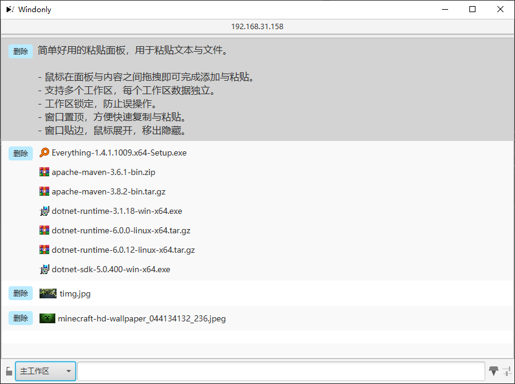

# Windonly

简单好用的粘贴面板，用于粘贴文本与文件。

- 鼠标在面板与内容之间拖拽即可完成添加与粘贴。
- 支持多个工作区，每个工作区数据独立。
- 窗口置顶，方便快速复制与粘贴。
- 窗口贴边，鼠标展开，移出隐藏，减少占用面积。
- 即开即用，不用安装。

## 图片

## 启动

启动有两种方式：

1. `clone`代码后使用**JDK17**环境运行`WindonlyApplication`
2. [下载](https://github.com/Verlif/windonly/releases)**zip**文件，解压后运行`windonly.exe`

## 打包成exe

打包推荐使用`jlink`和`jpackage`。

1. 更改`pom.xml`文件中的`build > plugins > plugin`下`org.openjfx`插件的`executable`标签值，改为本机的**jdk17的java可执行地址**。
2. 使用`jlink`生成运行文件，运行文件位于根目录下`target/windonly`中。至此就已经有可以运行的`bat`文件了（`target/windonly/bin.windonly.bat`）。
3. 使用以下命令运行`jpackage`，这里的`jpackage`地址填入本机的执行地址。生成的文件位于根目录下的`windonly`文件夹中。

    `"C:\Program Files\Java\jdk-17\bin\jpackage" --name windonly --type app-image -m idea.verlif.windonly/idea.verlif.windonly.WindonlyApplication --runtime-image .\target\windonly\ --icon src/main/resources/images/windonly.ico --java-options "-Dfile.encoding=utf-8"`

4. 将语言文件复制到`windonly`文件夹下。
5. 运行`windonly`中的`windonly.exe`。

## 升级

将打包好的文件整体替换过去即可。

## 其他

配置文件信息可以看这里 - [配置文件](./docs/config.md)

[小贴士](/docs/小贴士.md)
