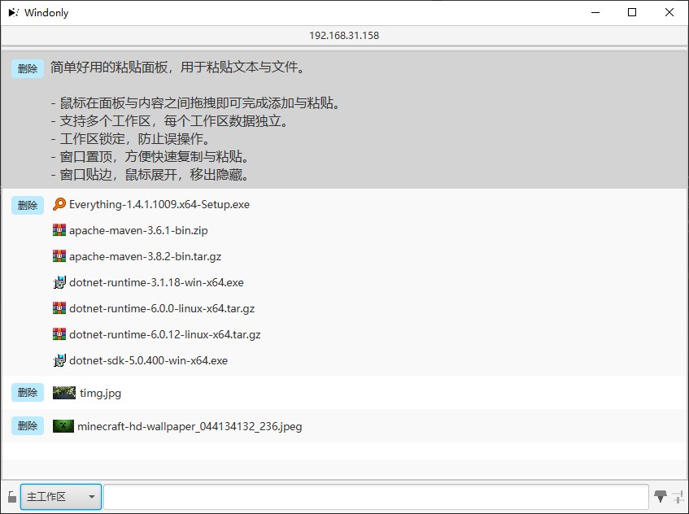

# Windonly

简单好用的粘贴面板，用于粘贴文本与文件。

- 鼠标在面板与内容之间拖拽即可完成添加与粘贴。
- 支持多个工作区，每个工作区数据独立。
- 窗口置顶，方便快速复制与粘贴。
- 窗口贴边，鼠标展开，移出隐藏，减少占用面积。
- 即开即用，不用安装。

## 图片



## 启动

启动有两种方式：

1. `clone`代码后使用**JDK17**环境运行`WindonlyApplication`
2. [下载](https://github.com/Verlif/windonly/releases)**zip**文件，解压后运行`windonly.exe`

## 打包成exe

一条命令完成全部打包（需要**JDK17或更高版本**）：

```
mvnw clean package
```

（已配置Maven Wrapper，无需本机安装Maven；`jpackage`会使用当前构建所用的JDK。）

打包完成后，免安装发行包位于`target/dist/windonly`：

```
windonly/
├── windonly.exe      双击运行，目标机器无需安装Java
├── lang/             语言文件（已自动复制，无需手动处理）
├── app/              应用与依赖jar
└── runtime/          内置的Java运行时
```

把整个`windonly`目录压缩后即可发布；升级时整体替换过去即可。

### 打包说明

- 打包由`pom.xml`中的`windonly-exe` profile 完成，在Windows上自动启用，
  依次执行：编译 → 收集依赖 → 打应用jar → `jpackage`生成exe → 复制语言文件。
- 只想编译而不打包时，用`mvnw clean package -P '!windonly-exe'`关闭该profile。
- 生成的是`app-image`免安装包，**不需要**安装WiX，也**不需要**再手工执行`jlink`/`jpackage`。
- 发行包内置运行时的JDK模块由`pom.xml`中的`app.runtime.modules`控制。
  如果以后用到了新的JDK模块（例如`java.sql`），需要在这里补充。
- 新增JavaFX模块时，除了`<dependencies>`，还要在`maven-dependency-plugin`的
  `copy-javafx-dependencies`中补一条对应平台的`artifactItem`（Maven上openjfx的非分类器jar是空壳）。
- 程序入口使用`idea.verlif.windonly.Launcher`而不是`WindonlyApplication`：
  直接以`Application`子类作为主类时，JDK启动器会强制要求JavaFX位于模块路径上，
  免安装包中JavaFX是以普通jar分发的，用普通类做入口可以绕开该限制。

### 开发时运行

```
mvnw javafx:run
```

## 升级

将打包好的`windonly`文件夹整体替换过去即可。

## 其他

配置文件信息可以看这里 - [配置文件](./docs/config.md)

[小贴士](/docs/小贴士.md)
