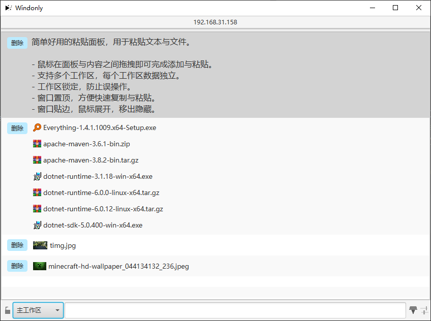

# Windonly

简单好用的粘贴面板，用于粘贴文本与文件。

- 将文件、文本等拖拽到面板即可添加。
- 从面板拖出数据即可粘贴。
- 支持多个工作区，每个工作区数据独立。
- 工作区锁定，防止操作。
- 窗口置顶，方便快速复制与粘贴。
- 窗口贴边，鼠标展开，移出隐藏。

## 图片

## 启动

JDK 17，通过直接运行WindonlyApplication直接启动，或自行打包。
